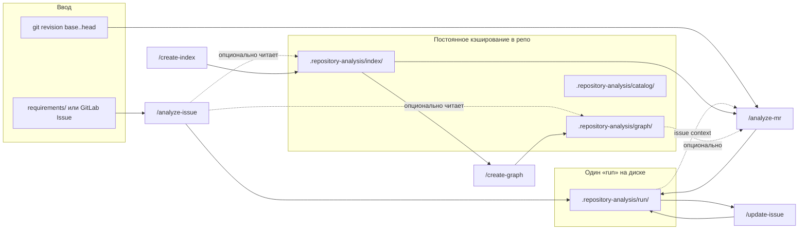

# Пути вывода скиллов: текущий флоу и предложения по UX

Документ для обсуждения (не контракт движка). Опирается на [README.md](../../README.md), [engine-contract.md](engine-contract.md) и [module.md](../../skills/mr-impact-method/references/module.md).

**Охват:** пять slash-команд (`analyze-issue`, `create-index`, `create-graph`, `analyze-mr`, `update-issue`). В разговоре часто выделяют **четыре «продуктовых» этапа** — Issue → индекс/граф → MR → обновление Issue; `create-index` и `create-graph` — подготовка репозитория, а не отчёт для человека.

---

## Общий флоу (как это задумано)



### Этапы по смыслу

| Порядок | Команда | Что делает | Куда пишет | Живёт после перезапуска |
| --- | --- | --- | --- | --- |
| 1 | `/analyze-issue` | Разбор требований, черновик тела Issue | `run/` | Нет (gitignore), если агент почистил |
| 2a | `/create-index` | Структурный индекс кода | `index/` | Да |
| 2b | `/create-graph` | Экспорт графа зависимостей | `graph/` | Да |
| 3 | `/analyze-mr` | Влияние MR, runtime/QA | тот же `run/` | Нет |
| 4 | `/update-issue` | Превью дополнения к Issue | тот же `run/` | Нет |

**Связка этапов:** MR-анализ может подхватить Issue-артефакты из `run/` (`01-generated-issue.md`, `issue-intent.json`). Update Issue **обязан** видеть MR-артефакты в **том же** `--run-dir`. Пользователю в промпте явно передаётся `run: .repository-analysis/run/`.

**Параллельный «скрытый» слой:** setup создаёт `_mr-impact/` (движок, скрипты, рендер workflow). Это не вывод скиллов, но в README рядом с `.repository-analysis` — легко смешать.

---

## Текущая схема каталогов

```text
<корень-репозитория>/
├── _mr-impact/                          # runtime setup (не артефакты анализа)
└── .repository-analysis/                # всё, что относится к «анализу репо»
    ├── index/                           # create-index
    │   ├── repository-index.sqlite
    │   ├── repository-index.json
    │   └── index-manifest.json
    ├── graph/                           # create-graph
    │   ├── dependency-graph.json
    │   └── graph-manifest.json
    ├── catalog/                         # опционально boundary-catalog.json
    └── run/                             # analyze-issue + analyze-mr + update-issue
        ├── 00-issue-analysis.md
        ├── 01-generated-issue.md
        ├── issue-intent.json
        ├── 01-mr-analysis.md … 04-test-plan.md
        ├── *.json (mr-context, impact-graph, …)
        ├── 05-issue-update.md
        ├── issue-update.json
        └── gitlab-input/                # при загрузке Issue с GitLab
```

### Имена файлов в `run/`

Нумерация `00`–`05` задаёт **глобальный порядок пайплайна**, а не «папку этапа»:

| Файл | Этап | Назначение для человека |
| --- | --- | --- |
| `00-issue-analysis.md` | Issue | Отчёт: пробелы, допущения |
| `01-generated-issue.md` | Issue | Текст для вставки в GitLab |
| `01-mr-analysis.md` … `04-test-plan.md` | MR | Отчёты по MR (номер **01** повторяется с Issue) |
| `05-issue-update.md` | Update | Превью обновления Issue |

JSON лежит рядом без префикса этапа (`issue-intent.json` vs `mr-context.json`).

---

## Почему это неочевидно для обычного пользователя

1. **Имя корня `.repository-analysis`** — техническое и «спрятанное» (точка в начале). Не ясно, что это *кэш MR Impact*, а не случайная служебная папка IDE/агента.

2. **Один каталог `run/` на всё** — Issue, MR и Update смешаны. Непонятно, что можно удалить перед новым MR, а что нужно оставить для `--issue-dir`. Правила есть в `run-cleanup.md`, но пользователь их не читает.

3. **Конфликт нумерации `01-*`** — `01-generated-issue.md` и `01-mr-analysis.md` выглядят как один «пакет», хотя относятся к разным командам.

4. **Разный жизненный цикл в одном дереве** — `index/` и `graph/` долгоживущие; `run/` эфемерный. В README они в одной таблице «Where outputs go» без сильного визуального разделения «кэш vs отчёт этой сессии».

5. **Параметр `run:` в `/update-issue`** — требует знать путь `.repository-analysis/run/`; альтернатива «просто продолжи после analyze-mr» в промпте не зашита.

6. **Два «01» в документации пайплайна** — в примере full pipeline ссылка на issue context: `issue context: .repository-analysis/run/01-generated-issue.md`, а не «последний issue-run».

7. **`repository-index.json` в README**, но в контракте движка в таблице persistent чаще фигурируют sqlite + manifest — лишняя когнитивная нагрузка.

8. **Нет имени сессии** — нельзя держать два параллельных эксперимента (два MR или два Issue) без ручного `--run-dir`.

---

## Предложения по улучшению (без обязательной смены движка сразу)

Ниже — уровни: от «только документация» до «ломающее переименование с алиасами».

### A. Документация и подсказки в чате (минимальный риск)

- В README добавить **одну «шпаргалку»** с двумя блоками: **«Кэш репозитория (не удалять)»** и **«Отчёты текущей работы (можно удалить)»**.
- В каждом skill `step-03-present` (или аналог) печатать **3 строки итога**: «Откройте файл X», «Кэш: index/graph не трогали», «Чтобы продолжить: следующая команда …».
- Для `/update-issue` по умолчанию не требовать `run:` в промпте — skill всегда использует layout по умолчанию из `paths.py` (уже `.repository-analysis/run`), а `run:` оставить только для продвинутых.

### B. Переименование корня (средний риск, высокая ясность)

Цель: имя должно говорить *продукт* и *роль*, не «repository analysis».

| Сейчас | Вариант 1 (явный бренд) | Вариант 2 (роль) |
| --- | --- | --- |
| `.repository-analysis/` | `.mr-impact/` | `.copilot-impact/` |
| `index/` | `cache/index/` или `model/index/` | `repo-index/` |
| `graph/` | `cache/graph/` | `dependency-graph/` |
| `run/` | `sessions/latest/` или `output/current/` | `reports/` |
| `catalog/` | `config/boundaries/` | `boundaries/` |

**Рекомендация:** если переименовывать корень — **не** использовать `_mr-impact` для артефактов (уже занято runtime setup). Лучше пара:

- `_mr-impact/` — движок (как сейчас)
- `.mr-impact/workspace/` или `.mr-impact/data/` — артефакты пользователя

Тогда в README: «всё, что вы открываете глазами — под `.mr-impact/workspace/`».

Технически: `ANALYSIS_DIR_NAME` в `paths.py` + алиас: при старте, если есть старый `.repository-analysis`, читать его или один раз мигрировать с предупреждением.

### C. Разделить `run/` по этапам (средний риск, лучше для цепочки)

Вместо одной кучи:

```text
.mr-impact/workspace/
├── issue/           # analyze-issue
├── mr/              # analyze-mr
└── issue-update/    # update-issue (или писать снова в issue/)
```

**Плюсы:** понятно, что удалять; нет коллизии `01-*`.  
**Минусы:** нужен явный «manifest» или convention для `--issue-dir` (например, всегда `workspace/issue/`).

Упрощённый компромисс **без смены корня**:

```text
.repository-analysis/run/
├── issue/
├── mr/
└── update/
```

Движок: `--run-dir` указывает на `run/mr/`, а `analyze-issue` пишет в `run/issue/`; `update-issue` читает `run/mr/` + опционально `run/issue/`.

### D. Переименование файлов отчётов (низкий/средний риск)

Заменить глобальную нумерацию на **префикс этапа**:

| Сейчас | Предложение |
| --- | --- |
| `00-issue-analysis.md` | `issue/analysis.md` или `issue/00-analysis.md` |
| `01-generated-issue.md` | `issue/gitlab-body.md` |
| `issue-intent.json` | `issue/intent.json` |
| `01-mr-analysis.md` … `04-test-plan.md` | `mr/01-summary.md` … `mr/04-test-plan.md` |
| `05-issue-update.md` | `update/preview.md` или `issue/update-preview.md` |
| `issue-update.json` | `update/payload.json` |

Имена **без ведущих цифр** проще для не-технарей; цифры оставить только внутри `mr/`, если важен порядок чтения.

Контракт `validate-artifacts`: профили `issue-run`, `mr-run`, `update-run` привязать к подкаталогам, а не к маске `01-*.md` в корне `run/`.

### E. Сессии с датой (для продвинутых, опционально)

```text
.repository-analysis/sessions/2026-10-01-feature-foo/
  issue/ … mr/ … update/ …
```

Skill по умолчанию пишет в `sessions/latest` (symlink или `session.json` с указателем). Пользователь видит папку с понятным именем, а не вечный `run/`.

### F. Что оставить как есть (осознанно)

- **SQLite + JSON graph** в отдельных `index/` и `graph/` — нормальная модель «дорогой кэш / дешёвый экспорт».
- **Gitignore только для run/sessions** — правильно; кэш индекса можно коммитить по желанию команды (отдельная политика).
- **Шаблон Issue в `.github/skills/analyze-issue/`** — логично как «исходник skill», не как вывод; в UX-доке явно: «это не результат анализа».

---

## Рекомендуемый пакет изменений (приоритет)

Если цель — максимум ясности при умеренной стоимости:

1. **Документация:** двухуровневая шпаргалка «кэш vs отчёты» + диаграмма как в этом файле в README.
2. **Структура `run/`:** подкаталоги `issue/`, `mr/`, `update/` (вариант C) — снимает главную боль смешения и дублирования `01-`.
3. **Имена файлов:** человекочитаемые имена без сквозной нумерации 00–05 (вариант D).
4. **Корень:** отложить полное переименование `.repository-analysis` до решения по бренду; если переименовывать — `.mr-impact/workspace/` с алиасом на старый путь один релиз.
5. **Промпты:** убрать обязательный `run:` из примеров `/update-issue`; оставить `revision:` только для MR.

---

## Открытые вопросы для решения

- Нужно ли пользователю **видеть** JSON (`issue-intent.json`, `impact-graph.json`) или достаточно ссылок из markdown в чате?
- Коммитить ли `index/` в Git для CI или всегда пересобирать на агенте?
- Один глобальный `run/` на репо vs **run на ветку** (`run/<branch-slug>/`) для параллельных фич?

---

*Версия: черновик для ревью UX путей вывода (2026-10-01).*
